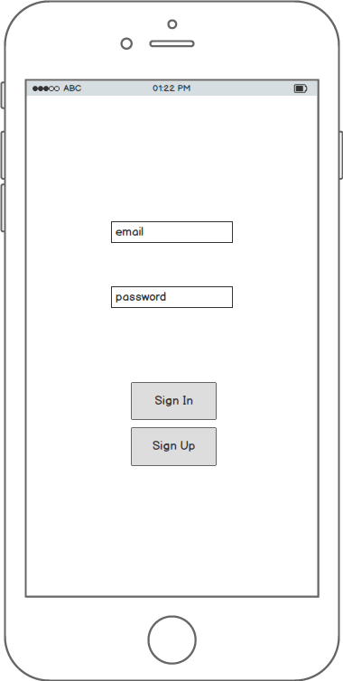
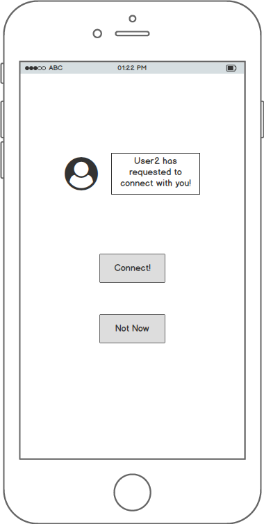
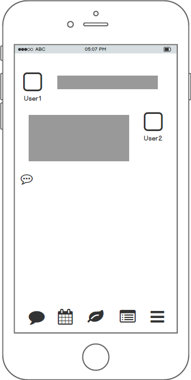
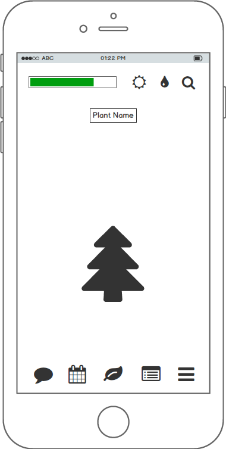

# Woven

## Background and Overview

Woven is an iOS mobile application connecting two best friends or a romantic couple through engaging, interactive experiences and a shared digital space.

Technology has allowed people to connect with the world in a new and powerful way. While platforms like Facebook, Instagram, and Snapchat encourage making as many connections as possible, there aren't many applications that focus on fostering intimate relationships between close friends or significant others. Woven allows people to focus on their most important relationship through standard chat features and other enjoyable shared user experiences, such as taking care of a virtual plant together.

[Link]()

## Functionality & Minimum Viable Product

This app will, at a minimum, satisfy the following criteria with smooth, bug-free navigation:

- [ ] New user sign up and sign in + authentication
- [ ] Demo website showcasing relevant app features
- [ ] User profile
- [ ] Tab navigation
- [ ] Virtual plant with interactive features
- [ ] Instant messaging with emoticon and image support
- [ ] Production README

### Bonus

- [ ] To-do List with CRUD functionality
- [ ] Activity Planner with Google Maps API
- [ ] App hosted on iOS App Store
- [ ] Live Video

## Design Documents

### Wireframes
+ Sign Up

+ Sign In

+ Approve

+ Chat

+ Plant

* [API Endpoints][api_endpoints]
* [React Components][component_hierarchy]
* [Sample Schema][sample_schema]
* [Sample State][sample_state]

[api_endpoints]: ./docs/api-endpoints.md
[component_hierarchy]: ./docs/component-hierarchy.md
[sample_schema]: ./docs/sample_schema.md
[sample_state]: ./docs/sample_state.md

## Group Members & Work Breakdown

Our group consists of five members: Greg Park, Evelyn Lee, Janet Lee, Jared Tan, Keith Wong.

Jared's primary responsibilities will be:
* Owning the overall structure and layout/navigation/functionality of the app.
* Timeline manager.
* Setting up user authentication via Auth0.
* Researching new technologies and libraries to incorporate into the project as appropriate.
* Finalizing the repo's README, complete with screenshots and code snippets.

Greg's primary responsibilities will be:
* Co-lead for live-chat functionality (front-end focus).
* Owning the functionality to incorporate images and sound into live-chat.
* Creating the Settings / Instructions page.

Evelyn's primary responsibilities will be:
* Co-lead for live-chat functionality (back-end focus).
* Co-creating the App Store page and marketing the app.
* Working with Jared to finalize the repo's README.

Janet's primary responsibilities will be:
* Co-lead for live plant functionality (front-end focus).
* Owning the front-end design of the Virtual Plant.
* Co-creating the App Store page and marketing the app.

Keith's primary responsibilities will be:  
* Co-lead for live plant functionality (back-end focus).
* Owning the interactive features of the Virtual Plant and its integration into the backend.

## Technologies and Technical Challenges

This mobile iOS application will be built using a MERN stack (MongoDB, Express.js, React Native, Node.js), which has many positives for this application.
+ Allows for JavaScript to be used for both client-side and server-side code.
+ React Native allows for quick prototyping and high initial velocity for a mobile application.
+ Object representation is JSON (JavaScript Object Notation) in both the back-end and the front-end.
+ Node.js's non-blocking I/O is great for quick simultaneous actions, like chat.

The technical challenges for this application will be:

+ Connecting our front-end with a NoSQL back-end database.
+ Understanding web-sockets and providing smooth user-to-user messaging.
+ Creating a virtual plant feature with a pleasing UI and seamless UX for user satisfaction.
+ Add graphics library / drawn images for the virtual plant.

## Technology details of MERN

### MongoDB
[mongoDB](https://npmjs.org/package/mongodb)

+ MongoDB is the database used in the MERN stack. Uses a NoSQL document-oriented database, with a flexible schema and a JSON based query language.
  + For example, for our app, we would have users and photos. Typically, a relational database would create two tables - one for users, one for photos with `user_id`. With a NOSQL database, we would store all the data as a single document, and fetch it all at once with any level of nesting.
+ MongoDB has the ability to index on deeply nested fields unlike RDBMS's.
+ Storing an object in a MongoDB database does not have to follow a schema like Rails.
+ Data is also retrieved in JSON format.  + Comes with a shell built on JS runtime like Node.js. (Like Rails C but for MongoDB)

### Express.js
[express](http://expressjs.com/)

+ The Express.js framework provides specific routes for data retrieved from HTTP requests.

+ Acts as the rails for Node.js.

+ Express parses request URL, headers and parameters via Regex. On the response side, it has, as expected, all functionality required by web applications. This includes setting response codes and setting cookies.

### React Native
[react native](https://github.com/facebook/react-native)
+ React Native library lets you build mobile apps using Javascript and React, indistinguishable from apps built with Obj-C, Swift, or Java.

### Node.js

[node.js](https://github.com/nodejs/node)
+ Google's V8 run-time environment used for running server-sided JavaScript. Used alongside express with MongoDB.

### Chat Overview

Chat is the most typical real-time, multi-user application.

Chat is the sweet-spot example for Node.js since it’s a lightweight, high traffic, data-intensive (but low processing/computation) application that runs across distributed devices. It’s also a great use-case for learning too considering this is our first time working with this technology. It’s simple, yet it covers most of the paradigms ever used in a typical Node.js application.

**How it works in Woven**

In Woven, we are dealing with a single chatroom with two people.

On the **server side**, we have a simple Express.js application which does 2 things:

+ 1) a `GET '/'` request handler in the chatroom box, for the message board / Send button to create a new message.

+ 2) Websockets server for messages from websocket clients.

+ **Websockets**: an upgrade to typical HTTP requests - allows for bi-directional data transfer between the client and server.
[socket.io](https://socket.io/) seems to work the best.
(as opposed to HTTP unidirectional flow where the server must take on all the client requests before moving on)

On the **client side**, we have:

+ a page with 2 handlers
  + 1) on the Send button, which picks up the input message.
  + 2) one that listens for new messages on the websockets client, AKA listens for messages sent by the SO, to update the `current_user`'s' message board.

**Step by step** here’s what happens when `current_user` sends a message.:

+ 1) app notices the 'Send' button click through a JS event handler.
+ 2) emits a websocket message through the websocket client connected to the server.
+ 3) the partner receives the new message as a push message through a websocket component running in the SO's application.
+ 4) message is obtained, and chat is updated.

### API Endpoints with MongoDB

If we were using Rails, we would need to convert to and from JSON. With Node.js, we can simply deliver JSON objects through RESTful APIs for the client. With MongoDB, we don't have to worry about the conversion between JSON and Ruby. Also, we avoid the need for multiple data-type conversions by using a uniform data serialization format across the client, server, and database.

## Implementation Timeline

### Phase 1: Learn Technologies (2 days)

+ Objective: All group members will dedicate the weekend to learning each component of the MERN (MongoDB, Express, React Native, Node.js) stack and become familiar with the overall workflow.

+ By the end of Day 2, we will have:
  + Completed Proposal README
  + Understanding of MERN

### Phase 2: Backbone (3 days)

+ Phase 2a: User Authentication (All) (1 day):
  + Objective: Set up user authentication via React Native and Auth0 API.
  + By the end of the Day 3, we will have:
    + User can sign up and login that persist through sessions unless logged out.

+ Phase 2b: Splash (Janet) + Home/Index Page (Keith/Jared) (2 days):
  + Objective: Set up functional index page for the application, that allows for easy access to other features.
  + By the end of the day, we will have:
    + An index page that allows the user to navigate to the app's features.

+ Phase 2c User Profiles (Greg and Evelyn) (2 days):
  + Objective: Set up User Profiles
  + By the end of the day, we will have:
    + Users can access and edit their profile page.

### Phase 3: MVP Features  (4 days)

+ Phase 3a: Virtual Plant (4 days) (Janet and Keith)
  + Features include:
    + Plant attributes: name of plant, type of plant, age, description, health, happiness.
    + Functionality: water, sunlight.
    + Display: feature icon, background with time of day, water button, feeding button, image of plant at different stages, name, happiness level, health of plant.

+ Phase 3b: Instant Messaging w/ [socket.io](https://socket.io/) (4 days) (Evelyn, Greg, Jared)
  + Features include:
    + Stickers / Emoticons
    + Photos
    + Mood tracker / status
    + Database for message storage

## Plan for getting users and reviews

+ All members will each share with at least 20 friends and family members.
+ Soft launch with close friends.
+ Janet will post in an appropriate sub-reddit and Product Hunt for exposure.
+ Evelyn will submit the app for review on the App store.
