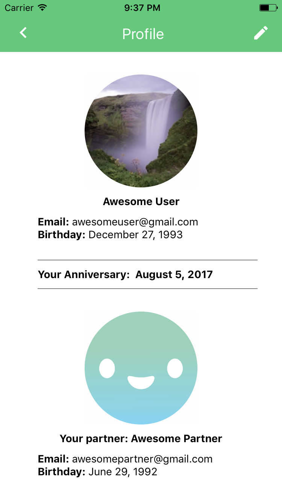
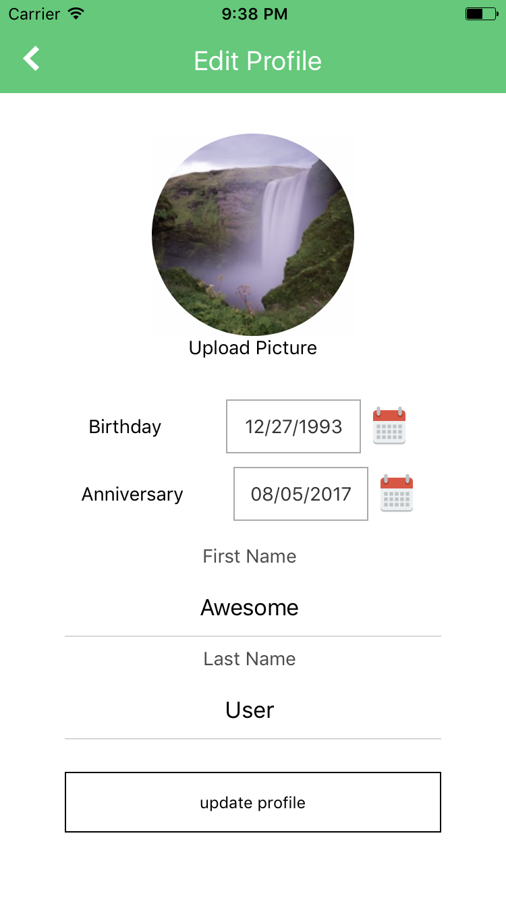

# Woven

[Link to Demo]()

Woven is an iOS mobile application connecting two best friends or a romantic couple through engaging, interactive experiences and a shared digital space.

Technology has allowed people to connect with the world in a new and powerful way. While platforms like Facebook, Instagram, and Snapchat encourage making as many connections as possible, there aren't many applications that focus on fostering intimate relationships between close friends or significant others. Woven allows people to focus on their most important relationship through standard chat features and other enjoyable shared user experiences, such as taking care of a virtual plant together.

[login]()

## Technologies

This project is built on MERN (MongoDB, Express.js, React Native, Node.js), which allows for quick development through both client-sided and server-sided JavaScript + JSON object notation. Express.js and Node.js in the back-end provides ease in data storage and fetching through custom APIs routes. Also, MongoDB used along with Mongoose provides simple schemas in a NoSQL document-style database. In the front-end, React Native is used for modular and uni-directional data flow, resulting in high initial velocity for mobile applications like Woven.

## Features and Implementation

Woven's database is set-up much differently than a typical CRUD application, containing `Connections` that link two users together with their shared `Plants`, `Messages`, and `To-Dos`.

### Connection

Connections are the bridge between a couple and their `Plant`, `Messages`, and `To-Dos`. Connections are saved to the database once two users sign up with matching `partnerEmails`.

### Users

In addition to having encrypted authentication, users must sign up with a partner and may edit their profile, name, birthday, and anniversary with their partner.






### Plant

Plants are stored in MongoDB under the `Connection` collection, where two connected users own and take care of a single instance of `Plant`. The plant has attributes that the couple take care of, which include `name`, `health`, and the last time of `water`. The plant's health is tied to how often the couple waters the plant and decrements when the owners forget, resembling the real life relationship of the owners. The plant is implemented with touch vibrations and continuous attribute updating.

### Messages

Messages have their own database Schema with `userId`, `text`, and `userImageUrl`, and are instantaneously sent and received through **web-sockets** using [socket.io](https://socket.io/). Web-sockets allow for bi-directional data flow between the server and client, which typical AJAX queries do not provide. Messages are sent and received only between the `currentUser` and their `partner`.

### To-Dos

To-Dos are stored in `Connection`, where a user may create and delete any To-Dos the couple has.

## Technical Info

### Connections

The `Connection` instances are created in the back-end `AuthController` when two users sign up with matching `emails`. This connection is the backbone of Woven and provides the couple a shared private digital space.

This code snippet displays the logic for `Connection` instantiations and Mongoose methods to accomplish it.

```javascript
const Connection = require('../models/connection');

exports.signup = function(req, res, next) {
  var email = req.body.email;
  var password = req.body.password;
  var firstName = req.body.firstName;
  var lastName = req.body.lastName;
  var partnerEmail = req.body.partnerEmail;
  if (!email || !password) {
    return res.status(422).json({error: "You must provide an email and password"});
  }

  User.findOne({email: email}, function(err, existingUser) {
    if (err) { return next(err) }
    if (existingUser) {return res.status(422).json({error: "Email taken"})}
    var user = new User({
      email: email,
      password: password,
      partnerEmail: partnerEmail,
      connectionId: null,
      firstName: firstName,
      lastName: lastName,
      imageUrl: 'https://d1ld1je540hac5.cloudfront.net/assets/img/default_avatar.png',
      birthday:  new Date(1978, 5, 30),
      anniversary: new Date(2010, 0, 1)
    });
    user.save(function(err) {
      if (err) { return next(err) }
      res.json({user_id: user._id, token: tokenForUser(user)});
    });
    User.findOne( {email: user.partnerEmail}, (err, partner) => {
      if (partner && partner.partnerEmail === user.email) {
        let newConnection = new Connection();
        newConnection.save();
        const userQuery = {email: user.email};
        User.update(userQuery, {
          connectionId: newConnection._id
        }, function(err, affected, resp) {
        });
        const partnerQuery = {email: user.partnerEmail};
        User.update(partnerQuery, {
          connectionId: newConnection._id
        }, function(err, affected, resp) {
        });
      } else if (partner && partner.partnerEmail !== user.email) {
        return res.status(422).json({error: "That user is already paired."})
      }
    });
  });
}

```

### Messages
Messages were implemented using the npm package [socket.io](https://socket.io/). By attaching the socket to the server, the server has the ability to ping the client and send messages.

```javascript
websocket.on('connection', (socket) => {
  clients[socket.id] = socket;
  socket.on('userJoined', (userId) => onUserJoined(userId, socket));
  socket.on('message', (message) => onMessageReceived(message, socket));
});
```

In the front-end, the socket is attached to the `API_URL` of the application's hosted cloud server, and is constantly ready to update the chatbox with received messages obtained from the server.

Once messages are obtained and received, the messages are rendered through [GiftedChat](https://www.npmjs.com/package/react-native-gifted-chat), which provides a clean and pleasant messaging interface.

```javascript
class Chat extends Component {
  constructor(props) {
    super(props);
    this.state = {
      messages: []
    };

    this.determineUser = this.determineUser.bind(this);
    this.onReceivedMessage = this.onReceivedMessage.bind(this);
    this.onSend = this.onSend.bind(this);
    this._storeMessages = this._storeMessages.bind(this);
    this.giftedUser = this.giftedUser.bind(this);

    this.socket = io(API_URL);
    this.socket.on('message', this.onReceivedMessage);
    this.determineUser();
  }

  componentWillMount() {
    this.props.requestPair(this.props.users.currentUser._id);
  }

  determineUser() {
    let userId = this.props.users.currentUser._id;
    this.socket.emit('userJoined', userId);
  }

  onReceivedMessage(messages) {
    this._storeMessages(messages);
  }

  onSend(messages=[]) {
    this.socket.emit('message', messages[0]);
    this._storeMessages(messages);
  }

  giftedUser() {
    if (!this.props.users.currentUser) { return (<View></View>); }
    return {
      _id: this.props.users.currentUser._id.toString(),
      name: this.props.users.currentUser.firstName,
      avatar: this.props.users.currentUser.imageUrl,
      connectionId: this.props.users.currentUser.connectionId
    };
  }

  render() {
    if (!this.props.users) { return null; }
    return (
      <View style={styles.chatbox}>
        <View style={styles.topBar}>
          <Text style={styles.title}>Chat</Text>
        </View>
        <GiftedChat
          messages={this.state.messages}
          onSend={this.onSend}
          user={this.giftedUser()}
          renderBubble={this.renderBubble.bind(this)}
          />
      </View>
    );
  }

  renderBubble(props) {
    return ( <Bubble {...props}
      wrapperStyle={{
          left: {
            backgroundColor: '#F5F5F5',
          },
          right: {
            backgroundColor: '#208e4e'
          }
        }} />
    );
  }

  _storeMessages(messages) {
    this.setState(Object.assign({}, {messages: messages.concat(this.state.messages)}));
  }
}
```

## Design Documents

* [View Wireframes][views]
* [Database Schema][db_schema]
* [API Endpoints][api_endpoints]
* [Sample State][sample-state]

[views]: ./docs/views.md
[db_schema]: ./docs/schema.md
[api_endpoints]: ./docs/api-endpoints.md
[sample-state]: ./docs/sample-state.md


## Future Plans

### Activity Planner

The couple using the app would likely plan events or dates together, and having a feature that implements Google Maps API for locations and/or Google Maps Calendar would provide a useful logistical service.

### iOS App Store

This app has the potential for scalability, and will be ready to deploy to the App store as a full-fledged mobile application. To market and publicize the product, Woven will be displayed on high traffic sites such as Reddit or Product Hunt.

### Android / Web

Once optimized for iOS, this app can be cloned into a React Native Android application and web application to become more widely accessible.
